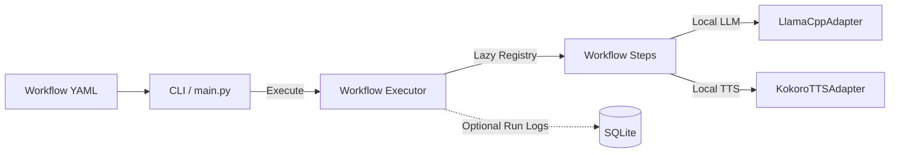

# Kokoro AI Workflow Engine

A highly modular, local-first workflow execution engine built in Python. It loads workflows from simple YAML files, reads local files, summarizes their content using local LLMs (via `llama-cpp-python`), and converts the result to spoken audio with local TTS (via `kokoro`).

The engine features strict Pydantic validation, interface-based design for offline testing, optional SQLite run tracking, and a clean Command-Line Interface (CLI).

---

## Architecture Overview

The system is built to decouple execution logic from third-party runtimes:

- **Lazy Loading:** Heavy libraries (`llama-cpp-python`, `kokoro`) and neural weights are only loaded if a step requires them. Commands like `validate` or `pytest` execute in milliseconds.
- **Pydantic Type Safety:** Configurations are validated before runtime to prevent execution failure from simple configuration typos.



---

## Repository Layout

```text
kokoro-ai-workflow-engine/
├── pyproject.toml              # Project metadata, scripts, and extras
├── main.py                     # CLI launcher entry point
├── README.md                   # This document
│
├── core/                       # Core engine execution mechanics
│   ├── engine.py               # YAML safely loader & Pydantic models
│   ├── executor.py             # Sequential step runner orchestrator
│   ├── registry.py             # Lazy assembly step registry
│   ├── state.py                # Dict-based workflow variable container
│   └── interfaces.py           # Shared boundary Protocols (PEP 544)
│
├── steps/                      # Decoupled workflow step implementations
│   ├── base.py                 # Abstract base step class
│   ├── read_file.py            # Local file reader step
│   ├── summarize.py            # Local LLM summary step
│   └── speak.py                # Local TTS audio generator step
│
├── ai/                         # Local AI clients & adapters
│   ├── llama_cpp.py            # GGUF model adapter via llama-cpp-python
│   └── kokoro.py               # Speech generation adapter via Kokoro-82M
│
├── storage/                    # SQLite metadata persistence
│   ├── database.py             # Connection context manager
│   └── repository.py           # Database transaction queries
│
└── tests/                      # 100% mocked offline test suite
```

---

## Workflow Configuration

Workflows are declared as a sequential chain of steps in YAML format:

```yaml
name: speak_summary
description: Read, summarize, and synthesize speech locally.
steps:
  - id: read_input
    type: read_file
    config:
      path: examples/input.txt
      output_key: text

  - id: summarize_text
    type: summarize
    config:
      input_key: text
      output_key: summary

  - id: speak_summary
    type: speak
    config:
      input_key: summary
      output_key: audio_path
      output_path: assets/audio/summary.wav
      voice: af_heart
```

---

## Quick Start

### 1. Installation

Install core dependencies alongside local AI runtimes:

```bash
pip install -e ".[local]"
```

### 2. Local Model Configuration

Point to a downloaded local GGUF model. Supported examples:
- Qwen3.5-2B-GGUF
- Qwen2.5-3B-GGUF
- Llama 3.2 3B-GGUF
- Phi-4 Mini-GGUF

Linux/macOS
```bash
export LLAMA_CPP_MODEL_PATH="/path/to/models/your-model.gguf"
```

Windows PowerShell
```powershell
$env:LLAMA_CPP_MODEL_PATH="E:\Models\Qwen3.5-2B-Q4_K_M.gguf"
```

### 3. Usage

Validate a workflow YAML without executing any code:

```bash
python main.py validate workflows/speak_summary.yaml
```

Run a workflow and display the final state:

```bash
python main.py run workflows/speak_summary.yaml
```

Persistence is optional.
If enabled, workflow execution metadata is stored in a local SQLite database.
No external database server is mandatory.

You can also run a workflow and persist the execution metadata to SQLite (requires `SQLITE_DATABASE_PATH` env var):

```bash
python main.py run workflows/speak_summary.yaml --persist
```

---

## Development & Testing

Tests are entirely mocked, enabling rapid development without downloading model weights or requiring a GPU:

```bash
# Run the complete test suite
pytest
```


## Learning Goals

This project demonstrates:

- Workflow orchestration
- Local LLM inference via llama.cpp
- Local TTS synthesis via Kokoro
- YAML-driven execution pipelines
- Interface-based architecture
- Dependency inversion and lazy loading
- Validation with Pydantic
- Automated testing
